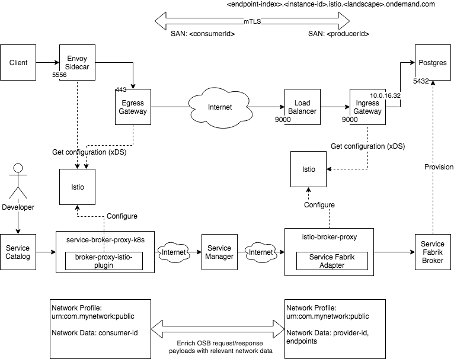
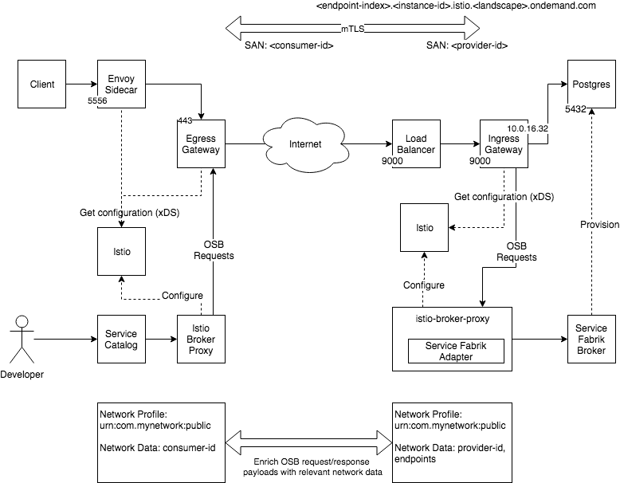
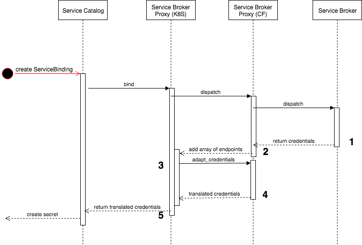

# Overview

## Plugin scenario



## Standalone scenario




## Data Plane

### Data Flow

The traffic from a consumer app to a managed service will be routed via an Istio sidecar proxy, an Istio egress gateway and an Istio ingress gateway.

1. The Istio sidecar proxy captures all traffic originating in the application container.
1. For each managed service, there is a K8s service that consumer apps can address.
1. For TCP traffic with the IP of a K8s service, the sidecar originates TLS with the Istio provided certificate and \<service-name\>.\<producer-id\> (e.g. pinger.istio.cf.sapcloud.io) as SNI to the egress gateway on port 443.
1. The egress gateway terminates TLS presenting the Istio provided certificate.
1. The egress gateway originates TLS with a certificate subject alternative name (SAN) set to a global cluster identifier (the consumer id) and \<service-name\>.\<producer-id\> as SNI.
1. The traffic is routed via the public internet.
1. The Istio ingress gateway terminates TLS with a certificate SAN set to a global cluster identifier (the producer id)
1. The Istio ingress gateway routes traffic with correct SAN and SNI host to the service instance.

### Configuration Resources

**Consumer Side**


1. A _ServiceEntry_: One Kubernetes service for the consumer to address (one per endpoint) defines a virtual IP, which is used to distinguish dispatch services on the sidecar.
1. One _VirtualService_ on mesh: route from the sidecar to the egress gateway (destinationSubnets points to the VIP of the kubernetes service (1) created in the cluster).
1. A _DestinationRule_ sets up mTLS Istio-mutual between sidecar and egress gateway, sets SNI to <service-name>.<producer-id> so that the request can be dispatched on the egress gateway.
1. A _Gateway_ on egress gateway port 443 describes listener on egress gateway and is configured to use the default certificates for (Istio-)mutual TLS
1. Another _VirtualService_ on egress gateway: routes traffic to the provider public endpoint \<service-name\>.\<system-domain\><sup>1</sup>. This is the public endpoint visible on internet on AWS an elastic load balancer (e.g. pinger.istio.cf.dev01.aws.istio.sapcloud.io).
The host name used will be resolved via a wildcard DNS entry (here: *.istio.cf.dev01.aws.istio.sapcloud.io).
1. A _DestinationRule_ sets up mTLS with the provider public endpoint, sets SNI to \<service-name\>.\<producer-id\> so that the request can be dispatched on provider side. Moreover, the expected SAN is set to <producer-id>.

1\) Note that system-domain and provider-id/producer-id are equal in our scenario (istio.cf.\<landscape-domain\>).

**Provider Side**

1. A _Gateway_ to set up mTLS with consumer clusters, configures own certificate, requires client certificate.
1. A _VirtualService_ the dispatches on SNI to the correct _ServiceEntry_
1. A _ServiceEntry_ that describes the endpoint on which the real service is reachable.

## Control Plane

The user request to create/bind/unbind/delete a service is routed through a chain of open service broker proxy implementations.

1. The consumer side Istio broker proxy adds Istio metadata to the request.
1. The Service Fabrik creates services/bindings.
1. The provider side Istio broker proxy adds Istio metadata to the response.
1. Both Istio broker proxies configure Istio to setup routing according to the above data plane description.


# Binding Service


**1 Credentials**

````json
{
    "credentials": { "host": "my-cf-service",
                     "port": 1234,
                     "uri": "http://my-cf-service:1234"
                }
}
````

**2 Credentials and Endpoints**

````json
{
    "credentials": { "host": "my-cf-service",
                     "port": 1234,
                     "uri": "http://my-cf-service:1234"
                },
    "endpoints": [
        {  "host": "my-cf-service", "port": 1234  }
    ]
}
````

**3 Call adapt_credentials**

````json
{
    "credentials": { "host": "my-cf-service",
                     "port": 1234,
                     "uri": "http://my-cf-service:1234"
                },
    "endpoint_mappings": [
        {
            "source": {  "host": "my-cf-service", "port": 1234  },
            "target": {  "host": "my-k8s-service", "port": 6789  }
        }
    ]
}
````
**4 Translated Credentials**

````json
{
    "credentials": { "host": "my-k8s-service",
                     "port": 6789,
                     "uri": "http://my-k8s-service:6789"
                }
}
````

# Misc

## Install pre-commit hook:

The hook will
* Call `go fmt`

```
cd .git/hooks
ln -s ../../hooks/pre-commit pre-commit
```

## istio-broker

Forward all requests to the service fabrik.

### Steps to deploy:

* Deploy the app:
```
  cf push istio-broker
```

* Delete the service fabrik broker (There might be some services, that have to be deleted before).
```
  cf delete-service-broker service-fabrik-broker
```

* Create a new service broker with the credentials of the service fabrik and the URL of the pushed app. The credentials are found in deployments/service-fabrik/credentials.yml as credentials.broker.user and credentials.broker.password.
```
cf create-service-broker istio-broker <user> <password> https://istio-broker.cfapps.<landscape-domain>
```

* Create an application security group using [sec_group.json](sec_group.json)
```
cf create-security-group istio-broker-service-fabrik sec_group.json
```

* List services using `cf service-access` and enable services using `cf enable-service-access`.

* Check that services are available
```
cf marketplace
```


### Steps to validate

* Use service broker
```
cf service-brokers
cf create-service postgresql v9.4-dev mydb
cf delete-service mydb
```

* Check tracking
```
curl https://istio-broker.cfapps.<landscape-domain>/info
```
